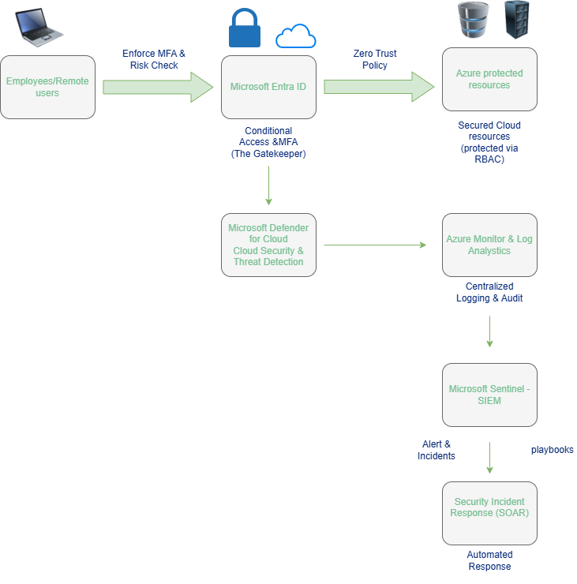

# Microsoft Azure Zero Trust & SOC Architecture

## Project Overview

The project sets out a conceptual cloud security architecture which combines the fundamentals of Microsoft Azure with the ideas of a Security Operations Centre (SOC).

The aim is to show how identity protection, access control, cloud security monitoring, centralized logging, threat detection, SIEM, and incident response can all function together in an Azure environment based on Zero Trust.

This project was carried out as part of my learning process following my completion of the **Microsoft Azure Fundamentals (AZ-900)** and during my ongoing development of knowledge in the area of **SOC operations and cloud security**.

---

## Architecture Diagram

The architecture illustrates an end-to-end security workflow:

**Users → Identity & Access → Azure Resources → Monitoring & Detection → SIEM → Incident Response**

---

## Architecture Flow

### 1. Users and Remote Access

The architecture begins with:

- Employees
- Remote Users

Users try to access the cloud resources of an organization via Microsoft Entra ID.

---

### 2.Microsoft Entra ID

Microsoft Entra ID functions as the layer for identity and access management.

The architecture includes:

- Multi-Factor Authentication (MFA)
- Conditional Access
- Risk-based access checks
- Identity-based access control

The aim is to check users before giving them access to cloud resources.

---

### 3. Zero Trust

The architecture follows a **Zero Trust approach** based on the principle:

Don’t trust; instead, always verify.

The decisions regarding access are constantly assessed using identity, risk, and permissions rather than automatically believing anything about a user or a device.

---

### 4. Authorization of resources and RBAC

Azure resources are protected using:

**Role-Based Access Control (RBAC)**

RBAC enforces the principle of **least privilege** by granting users and services only the permissions that they need.

---

### 5. Microsoft Defender for Cloud

Microsoft Defender for Cloud offers cloud security features, including security posture management and threat detection.

In this architecture Defender for Cloud functions as an extra security layer capable of detecting security issues and generating security alerts.

The security signals can be incorporated into the wider monitoring and SOC workflow.

---

### 6.Azure Monitor and Log Analytics

Azure Monitor and Log Analytics offer the ability to perform centralized monitoring and logging.

They can collect and analyze information such as:

- Activity logs
- Resource logs
- Audit information
- Monitoring data
- Security-related events

With centralised logging you can see what is happening throughout the Azure environment.

---

### 7. Microsoft Sentinel, SIEM

The SIEM aspect of the architecture is provided by Microsoft Sentinel.

Sentinel can collect security data from multiple sources and help security teams:

- Analyze security events
- Detect suspicious activity
- Correlate events
- Create analytics rules
- Generate incidents
- Investigate security alerts

The layer links cloud monitoring with SOC operations.

---

### 8. Detection and alerting

Security events can be analysed using detection and analytics rules.

A simplified workflow is:

**Logs → Analytics Rules → Alerts → Incidents**

Detection logic can be used to spot suspicious activities and give security analysts with actionable alerts.

---

### 9. Incident Response & SOAR

Incident response refers to the steps a team takes to detect, investigate, contain, and recover from security incidents.

SOAR stands for Security Orchestration, Automation, and Response. it helps security teams automate routine tasks, coordinate security tools, and execute response actions using playbooks.  

When a security incident has been identified, automated workflows can assist with the response and remediation.

The conceptual workflow is:

**Incident → Playbook → Automated Response → Remediation**

 Microsoft Sentinel playbooks can be used to automate certain response actions and to integrate with other security services.

---

## Key Security Concepts

This architecture demonstrates several key cloud security and SOC concepts:

- Zero Trust
- Identity & Access Management (IAM)
- Multi-Factor Authentication (MFA)
- Conditional Access
- Risk-Based Access
- Role-Based Access Control (RBAC)
- Least Privilege
- Threat Detection
- Centralized Logging
- SIEM
- SOAR
- Security Monitoring
- Incident Detection
- Incident Response
- Automated Remediation

---

## Azure Services & Technologies

| Technology | Role in the Architecture |
|---|---|
| Microsoft Entra ID | Identity and access management |
| MFA | Strong user authentication |
| Conditional Access | Risk-based access decisions |
| Azure RBAC | Authorization and least privilege |
| Microsoft Defender for Cloud | Cloud security and threat detection |
| Azure Monitor | Monitoring and telemetry |
| Log Analytics | Centralized log collection and analysis |
| Microsoft Sentinel | SIEM and security analytics |
| Sentinel Playbooks | Automated response and SOAR |

---

## SOC Perspective

From a SOC perspective, the architecture demonstrates a simplified security operations lifecycle:

**Identity → Access Control → Log Collection → Monitoring → Threat Detection → Alerting → Incident Response**

---

## Project Scope

This repository is a conceptual architecture and a learning project.

The diagram illustrates the way in which Azure security services and SOC technologies can be integrated into a security workflow and it does not state that a production enterprise environment has been put into use.

---

## Future Improvements

Future improvements could include:

- Deploy Microsoft Sentinel in an Azure environment
- Connect Microsoft Entra ID logs
- Configure Log Analytics
- Integrate Microsoft Defender for Cloud
- Create Sentinel Analytics Rules
- Generate and investigate security alerts
- Create Sentinel Playbooks
- Automate incident response actions
- Simulate security incidents
- Document the investigation and response process

---

## What I Learned

As part of this project I investigated how the various Azure security services can work in conjunction with one another and how they relate to SOC operations.

Key areas I focused on include:

- Cloud identity security
- Access control
- Zero Trust principles
- Azure monitoring
- Centralized logging
- SIEM concepts
- Threat detection
- Incident response
- SOAR and automation

---

## Learning Journey

This project represents the connection between two areas I am currently developing:

**Microsoft Azure Fundamentals (AZ-900)**  
↓  
**Cloud Security**  
↓  
**SOC Operations**  
↓  
**SIEM / Threat Detection**  
↓  
**Incident Response & SOAR**

---

## Conclusion

To ensure cloud security it is necessary to have visibility, enforce strong identity controls, implement least-privilege access, carry out continuous monitoring, detect threats, and have an effective incident response.

This project presents a conceptual method of integrating these capabilities in Microsoft Azure and at the same time supporting a Zero Trust security model.

This is part of my continuous journey of learning in the field of Cloud Security and Security Operations (SOC).

---

## Disclaimer

This project was created for educational and portfolio purposes.The architecture represent my understanding of Azure security and SOC concepts. It is conceptual design and does not represent a complete production.

---

## Author
**Enshirah Khader**
**Cybersecurity Student | SOC & Cloud Security Learner**
